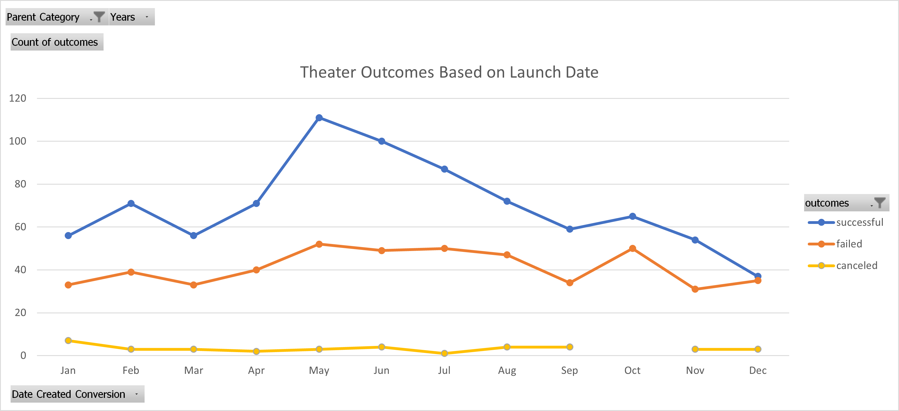
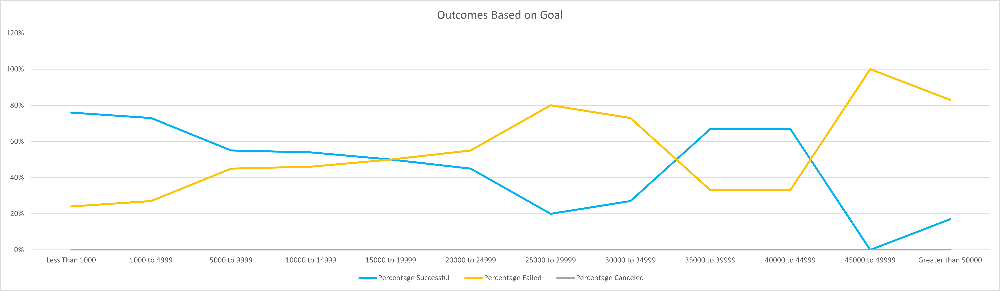

# An Analysis of Kickstarter Campaigns
[Kickstarter_Challenge](Kickstarter_Challenge.zip)

## **Purpose**:
This analysis is meant to compare the goal funding amount for each project with its eventual outcome and to compare both criteria with the duration of each project's fundraising timeline to find trends in success or failure for the projects. After creating the dataset in the datasheet, Louise found her project came close to the stated goal quickly and wanted to compare the same criteria for other projects to see if her play's success was a common situation or an irregularity among her dataset. The analysis was then presented in different visual formats to easily and clearly show the trends Louise was curious about and allow other viewers of the data to understand these trends without requiring a deep familiarity with such data.

## **Analysis and Challenges**:

The initial analysis of the data required breaking down the sections into easier values to map out in tables and images, such as separating the "Category and Subcategory" field into their own column fields and converting the launch dates and deadline dates into easily read formats. Excel allows for the category separation with the "Convert Text to Columns Wizard" and the date changes are possible by a formula to divide the values in question from seconds into days and applying the "DATE" function to count from 1970 to the timepoint that the date in question occurs. Using the 
```
=(((J2/60)/60)/24)+DATE(1970,1,1) 
```
line the adjusted "J" column value is applied to the cells in the "S" column to determine the "Date Created Conversion" values and extended throughout the column for all "J" column values presented in the original dataset. This formula was also applied to the "I" column's values to likewise determine the "Date Ended Conversion" values in column "T". From these new values a "Years" field was populated with the "S" column values and applying the "YEAR" function to create a simplified field that was necessary for creating visual charts.

### *Analysis of Outcomes Based on Launch Date*:
The first visual mapping was created with the "Outcomes Based on Launch Date" with the data processed into a Pivot Table and arranged with the filters for the project type and years that the fundraising period ran being applicable to the entire table for easy focus on the data Louise is interested in. The months for each year were made the Row Labels and the outcomes for each project were presented in order based on the success of those projects for a clear distinction between the values that focused on projects that were successful and then showed which were not. The table was then filtered to display only the values desired, which were the theater projects. The table was then able to show all the information that Louise wanted to know about her dataset, as shown below.

  
This data table was then processed into a line chart for a visual mapping of these values for quick analysis using Excel's chart generator and the axes were populated with the number of projects on the vertical axis and the months for each launch date presented on the horizontal axis. The mapped data values were then presented and connected with distinct lines for each outcome scenario to show the trends of project success based on the month across all years in question, as shown in the image below.

### *Analysis of Outcomes Based on Goals*:
The second analysis was conducted to determine the Outcomes Based on Goals trend that compared the goal value of each project with the success of each project at the end of their fundraising period. Using the "COUNTIFS" function the number of successful, failed and canceled projects could be broken down into their own fields by the dollar value of each goal in ranges of $5,000 from a goal of less than $1,000 to a goal of more than $50,000. The formula

```
=COUNTIFS(Kickstarter!$F:$F,"successful",Kickstarter!$D:$D, "<1000",Kickstarter!$R:$R,"plays")
```

was used to display the specific number of play projects that were both successful and had a goal that was less than $1,000. This formula type was then applied to each cell to populate the fields by adjusting the goal range amounts and then by adjusting the outcome of each play project as needed. Following this, the number of projects for each goal range were added up using the "SUM" function in the formula

```
=SUM(B2:D2)
``` 

and applied to each row to find the total projects for each goal range value. This field then made it possible to determine the percentage of each outcome in that goal range based on the total projects for the goal range in question by using the "ROUND" function in the formula

```
=ROUND(B2/E2,2)
```

and applied for each row value and then for each column value to reflect the different goal ranges and each play project's outcome. Using these valuable fields, a line chart to display the Outcomes Based on Goal trend was created through Excel's chart generator with the vertical axis representing the percentages of each outcome field and the horizontal axis representing the goal range values, as shown in the image below.
1

### *Challenges and Difficulties Encountered*:
The challenges presented in analyzing this data were few and easily overcome by Microsoft's support pages that outline the purposes and parameters of each function available in Excel, as well as the boxes that are shown to lay out the expected values for each function included in Excel as the user is constructing their formula. The biggest challenge in creating these analyses was the successful use of the "COUNTIFS" function to ensure Excel recognized each criteria correctly. This initially was difficult because the pop-up box below the formula bar showed brackets to be used to separate the different sections and were included while writing the formula needed. Once it became clear the brackets were causing an error with the function recognition, their removal yielded a successful execution of the functions. The only other difficulty presented in the analyses was the number of canceled plays that all came back as 0 values while conducting the second analysis, which was at first created a concern that the formulas were applied incorrectly. However, by filtering the initial Kickstarter datasheet to show the canceled values and checking the Subcategory field it became clear there was simply no data to represent and the 0 values were not an error but were accurate data.

## **Results**:
Using the tables and charts created in the analyses, several conclusions can be drawn about the data that Louise would be interested in. 
### *Outcomes Based on Launch Date*:
1. The largest number of successful projects were launched in May across the different years recorded for theater projects.
2. The chances of success or failure for projects launched in December seem to be equal, indicating starting a fundraising project December for a theater project is a risky choice.

### *Outcomes Based on Goals*: 
1. Project goals listed at $15,000 or higher have an increasing chance of failure as opposed to success.

### *Limitations*:
The dataset available for analysis includes a detailed look into the types of data needed to see the trends for what projects are best funded and what situations provide the best chance for a successful crowdfunding campaign. Some parts of the data are limited, however, with the impact that the individual or entity running the campaign can have on the success of their projects. The reputation of the major figures associated with the different projects and the campaign creator’s record of success or failure in running other projects can give a deeper insight into other trends for why a project could be successful or not. Despite the limitations of the data available for these Kickstarter campaigns, a major component of data analysis is the impossibility to account for every detail associated with the information. In addition to this, often some details are not necessary to reveal the major trends the analyst may be looking for and the effort needed to account for this extra data may outweigh the benefits such an analysis may provide.

### *Other Possibilities For Visual Representation*:
As is always the case with data analysis, providing a visual representation of the analysis limits the focus to certain data fields and omits others. A different type of visual representation that could provide a useful insight into the data would be a Clustered Column – Line chart that compares the subcategories to the percentage funded and a line of the average donation to see a trend in popularity for those projects among larger populations. This type of chart would also show a trend between which projects often need larger donations from a limited number of backers to be successful, as opposed to other projects that would need to focus on a larger number of backers because the average donation sizes could be expected to be smaller.


